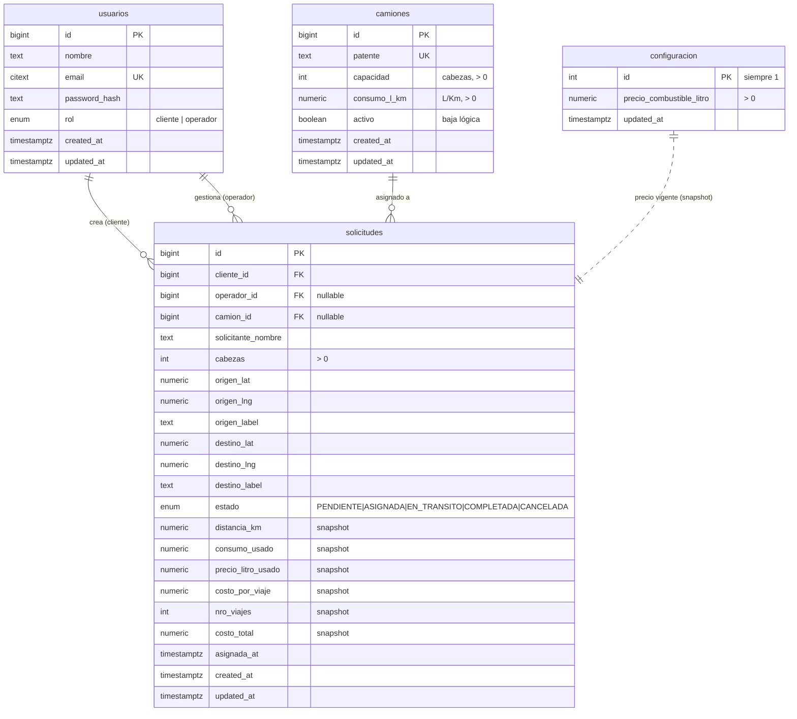

# 03 · Modelo de Datos — BoviTrans MVP

> **Estado:** borrador en revisión
> **Motor:** PostgreSQL 16 (ver ADR de motor abajo)
> **Deriva de:** [`01-analisis-de-negocio.md`](01-analisis-de-negocio.md) y los ADRs de
> [`02-decisiones.md`](02-decisiones.md). Cada constraint relevante referencia su ADR.

---

## 0. Decisión de motor: PostgreSQL

La pauta permite PostgreSQL o MySQL. Se elige **PostgreSQL** por:

- **Índices parciales únicos** → implementan la exclusividad camión↔solicitud activa
  (ADR-004) de forma declarativa y atómica, sin lógica de aplicación frágil.
- **Tipos ricos:** `ENUM` nativo para roles/estados, `NUMERIC` exacto para dinero y
  coeficientes, `CHECK` constraints expresivos (ADR-008).
- **Geografía:** soporte natural para coordenadas (lat/lng en `NUMERIC`/`DOUBLE`), y
  posibilidad futura de PostGIS sin migrar de motor.
- **Determinismo en cálculos monetarios:** `NUMERIC` evita los errores de redondeo de
  punto flotante en el costo de combustible.

---

## 1. Diagrama entidad-relación



---

## 2. Tablas en detalle

### 2.1 `usuarios` — (ADR-000)

| Columna | Tipo | Restricciones | Notas |
|---------|------|---------------|-------|
| `id` | `BIGINT` | PK, identity | |
| `nombre` | `TEXT` | NOT NULL | nombre o razón social |
| `email` | `CITEXT` | NOT NULL, UNIQUE | `CITEXT` = case-insensitive |
| `password_hash` | `TEXT` | NOT NULL | hash (bcrypt/argon2), nunca texto plano |
| `rol` | `rol_usuario` (ENUM) | NOT NULL | `cliente` \| `operador` |
| `created_at` | `TIMESTAMPTZ` | NOT NULL, default `now()` | |
| `updated_at` | `TIMESTAMPTZ` | NOT NULL, default `now()` | trigger de actualización |

### 2.2 `camiones` — (dominio, ADR-004, ADR-007)

| Columna | Tipo | Restricciones | Notas |
|---------|------|---------------|-------|
| `id` | `BIGINT` | PK, identity | |
| `patente` | `TEXT` | NOT NULL, UNIQUE | identidad, **inmutable** (ADR-007) |
| `capacidad` | `INT` | NOT NULL, `CHECK (capacidad > 0)` | cabezas por viaje |
| `consumo_l_km` | `NUMERIC(8,4)` | NOT NULL, `CHECK (consumo_l_km > 0)` | litros por km |
| `activo` | `BOOLEAN` | NOT NULL, default `true` | baja lógica (no se borra si tiene historial) |
| `created_at` | `TIMESTAMPTZ` | NOT NULL, default `now()` | |
| `updated_at` | `TIMESTAMPTZ` | NOT NULL, default `now()` | |

> Capacidad y consumo solo se editan si el camión no tiene solicitudes activas (ADR-007);
> esa regla se hace cumplir en la capa de servicio/API.

### 2.3 `solicitudes` — (ADR-001/002/003)

| Columna | Tipo | Restricciones | Notas |
|---------|------|---------------|-------|
| `id` | `BIGINT` | PK, identity | |
| `cliente_id` | `BIGINT` | NOT NULL, FK → `usuarios(id)` | quién la creó |
| `operador_id` | `BIGINT` | NULL, FK → `usuarios(id)` | quién asignó |
| `camion_id` | `BIGINT` | NULL, FK → `camiones(id)` | asignado |
| `solicitante_nombre` | `TEXT` | NOT NULL | dato visible en la tarjeta |
| `cabezas` | `INT` | NOT NULL, `CHECK (cabezas > 0)` | animales a mover |
| `origen_lat` | `NUMERIC(9,6)` | NOT NULL | |
| `origen_lng` | `NUMERIC(9,6)` | NOT NULL | |
| `origen_label` | `TEXT` | NULL | nombre legible del punto |
| `destino_lat` | `NUMERIC(9,6)` | NOT NULL | |
| `destino_lng` | `NUMERIC(9,6)` | NOT NULL | |
| `destino_label` | `TEXT` | NULL | |
| `estado` | `estado_solicitud` (ENUM) | NOT NULL, default `PENDIENTE` | (ADR-001) |
| `distancia_km` | `NUMERIC(10,2)` | NULL | snapshot al asignar (ADR-003) |
| `consumo_usado` | `NUMERIC(8,4)` | NULL | snapshot |
| `precio_litro_usado` | `NUMERIC(10,2)` | NULL | snapshot |
| `costo_por_viaje` | `NUMERIC(12,2)` | NULL | snapshot |
| `nro_viajes` | `INT` | NULL, `CHECK (nro_viajes >= 1)` | snapshot (ADR-002) |
| `costo_total` | `NUMERIC(14,2)` | NULL | snapshot |
| `asignada_at` | `TIMESTAMPTZ` | NULL | timestamp de confirmación |
| `created_at` | `TIMESTAMPTZ` | NOT NULL, default `now()` | |
| `updated_at` | `TIMESTAMPTZ` | NOT NULL, default `now()` | |

**Constraints de tabla:**

- `CHECK (origen_lat <> destino_lat OR origen_lng <> destino_lng)` — origen ≠ destino (ADR-008).
- `CHECK (estado = 'PENDIENTE' OR camion_id IS NOT NULL)` — toda solicitud no pendiente
  tiene camión.
- `CHECK ((estado IN ('PENDIENTE','CANCELADA')) OR (costo_total IS NOT NULL))` — los
  estados con asignación efectiva tienen snapshot de costo.

### 2.4 `configuracion` — (ADR-006)

| Columna | Tipo | Restricciones | Notas |
|---------|------|---------------|-------|
| `id` | `INT` | PK, `CHECK (id = 1)` | fila única (singleton) |
| `precio_combustible_litro` | `NUMERIC(10,2)` | NOT NULL, `CHECK (> 0)` | precio vigente |
| `updated_at` | `TIMESTAMPTZ` | NOT NULL, default `now()` | |

---

## 3. La restricción clave: exclusividad camión ↔ solicitud activa (ADR-004)

Un camión no puede estar en dos solicitudes en estado activo (`ASIGNADA` o `EN_TRANSITO`)
a la vez. Dos formas de implementarlo:

### Opción A — Índice parcial único (recomendada)

```sql
CREATE UNIQUE INDEX uniq_camion_activo
    ON solicitudes (camion_id)
    WHERE estado IN ('ASIGNADA', 'EN_TRANSITO') AND camion_id IS NOT NULL;
```

- ✅ **Declarativa y atómica:** la base garantiza la invariante; imposible violarla aun con
  llamadas concurrentes o directas a la DB.
- ✅ Cero lógica de aplicación que mantener.
- ➖ Específica de PostgreSQL (justifica la elección de motor).

### Opción B — Verificación transaccional en la aplicación

```sql
-- dentro de una transacción con SELECT ... FOR UPDATE sobre el camión
SELECT 1 FROM solicitudes
 WHERE camion_id = $1 AND estado IN ('ASIGNADA','EN_TRANSITO');
-- si existe → rechazar
```

- ➖ Requiere bloqueo explícito y es propensa a races si se implementa mal.
- ➖ La invariante vive en el código, no en los datos.

**Decisión:** **Opción A** (índice parcial único). La consistencia es responsabilidad de la
base; la API traduce la violación (error de unicidad) a un HTTP 409 claro.

---

## 4. Índices

| Índice | Tabla | Propósito |
|--------|-------|-----------|
| `uniq_camion_activo` (parcial) | `solicitudes` | exclusividad (ADR-004) |
| `idx_solicitudes_estado` | `solicitudes(estado)` | filtro del dashboard por estado |
| `idx_solicitudes_cliente` | `solicitudes(cliente_id)` | "mis solicitudes" del cliente |
| `idx_solicitudes_camion` | `solicitudes(camion_id)` | lookup por camión |
| `uniq_usuarios_email` | `usuarios(email)` | login / unicidad |
| `uniq_camiones_patente` | `camiones(patente)` | unicidad de patente |

---

## 5. Tipos ENUM

```sql
CREATE TYPE rol_usuario      AS ENUM ('cliente', 'operador');
CREATE TYPE estado_solicitud AS ENUM (
    'PENDIENTE', 'ASIGNADA', 'EN_TRANSITO', 'COMPLETADA', 'CANCELADA'
);
```

> Alternativa considerada: tabla de catálogo en lugar de ENUM. Para un MVP con estados
> estables, ENUM es más simple y autovalidante. Si los estados fueran dinámicos/editables
> por usuario, convendría una tabla catálogo.

---

## 6. Notas sobre dinero y precisión

- Todo valor monetario y los coeficientes usan **`NUMERIC`** (no `float`), para evitar
  errores de redondeo en el costo de combustible.
- `nro_viajes` se calcula como `CEIL(cabezas / capacidad)` en la capa de servicio y se
  persiste (ADR-002/003); no es columna generada porque depende del camión asignado en el
  momento de confirmar.

---

## 7. Datos semilla (resumen, detalle en `init.sql` — Fase 2)

- 1 fila de `configuracion` (precio combustible inicial).
- 1 usuario `operador` y 1–2 usuarios `cliente` de ejemplo.
- 3–5 `camiones` con capacidades y consumos variados (para probar el caso "no cabe").
- Varias `solicitudes` en distintos estados (incluida alguna que excede toda capacidad,
  para demostrar la sugerencia de múltiples viajes — ADR-005).
