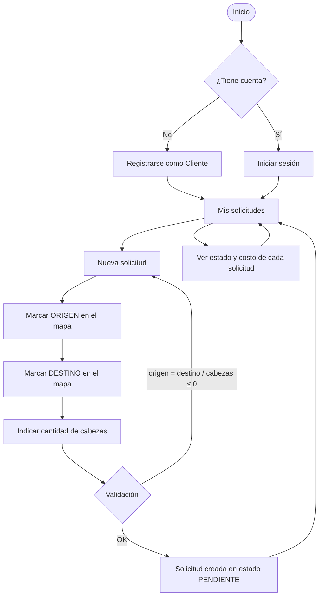
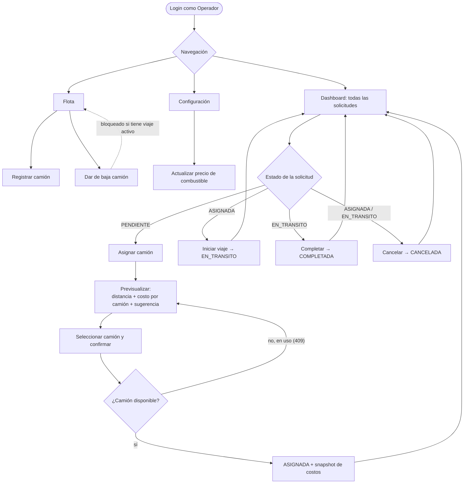
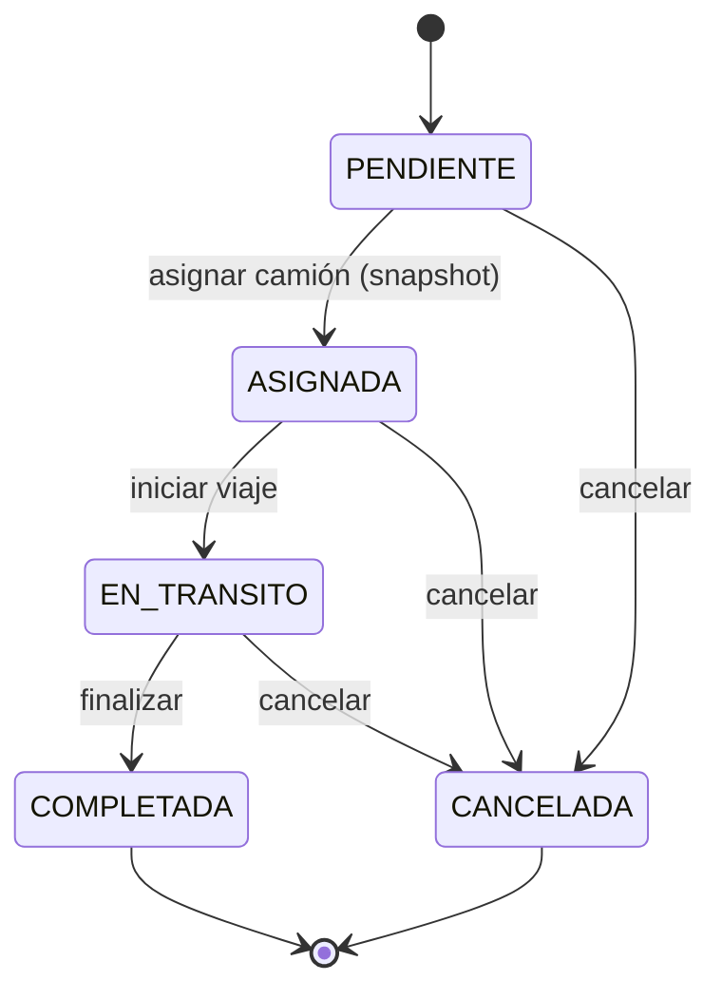
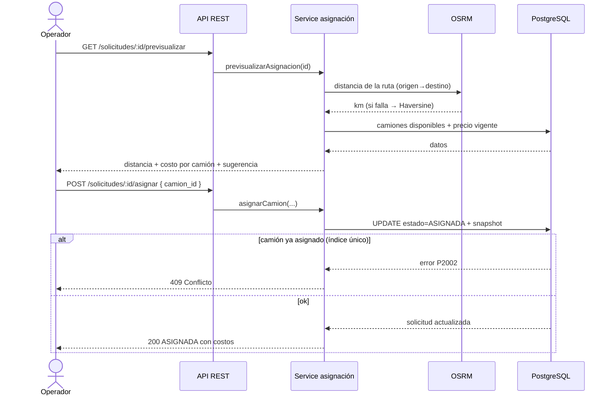

# 04 · Flujos de Usuario — BoviTrans MVP

> Diagramas de las acciones de cada rol y de los procesos clave. Los diagramas
> Mermaid se renderizan automáticamente en GitHub.

---

## 1. Flujo del Cliente

El cliente solicita traslados y hace seguimiento de su estado.



**Acciones del cliente**
| Acción | Resultado |
|--------|-----------|
| Registrarse / iniciar sesión | Acceso a su panel |
| Crear solicitud (mapa + cabezas) | Solicitud `PENDIENTE` asociada a él |
| Ver "Mis solicitudes" | Solo las suyas, con estado y costo (si fue asignada) |

> El cliente **no** ve solicitudes de otros ni la flota (autorización por rol).

---

## 2. Flujo del Operador

El operador administra la flota, asigna camiones y gestiona el ciclo de vida.



**Acciones del operador**
| Acción | Resultado |
|--------|-----------|
| Ver dashboard | Todas las solicitudes, con filtro por estado |
| Asignar camión | Cálculo de costo/capacidad → `ASIGNADA` con snapshot |
| Iniciar / Completar / Cancelar | Avanza el ciclo de vida (transiciones válidas) |
| Registrar / dar de baja camión | Gestión de flota (baja bloqueada con viaje activo) |
| Configurar precio de combustible | Afecta los cálculos siguientes (no los ya asignados) |

---

## 3. Máquina de estados de la solicitud (ADR-001)



Cualquier transición fuera de estas flechas se rechaza con HTTP `422`. Al pasar a
`COMPLETADA` o `CANCELADA`, el camión queda **liberado** automáticamente (el índice de
exclusividad solo cuenta estados activos).

---

## 4. Secuencia de asignación (el núcleo)



---

## 5. Interacción entre ambos roles

```mermaid
flowchart LR
    subgraph Cliente
      C1[Crea solicitud PENDIENTE]
    end
    subgraph Operador
      O1[Ve la solicitud en el dashboard]
      O2[Asigna camión y calcula costo]
      O3[Gestiona el viaje hasta COMPLETADA]
    end
    C1 --> O1 --> O2 --> O3
    O2 -. "estado/costo visibles" .-> C2[Cliente sigue el avance]
    O3 -. .-> C2
```
